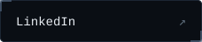
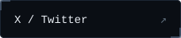
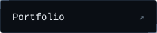
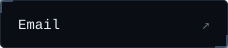
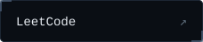
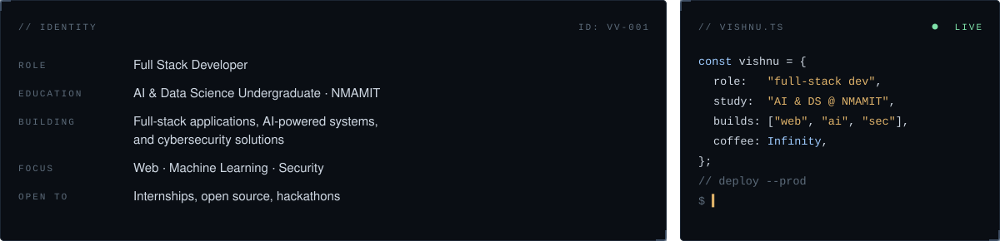
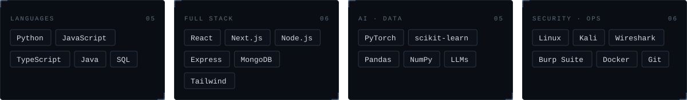

<!-- ============================================================
     PROFILE README — therealvishnuvardhan
     Edit the 5 links in the "Uplink" section with your real URLs.
     ============================================================ -->

  

  
  
  
  
  

  

  

  
  

  
  

  

  <picture>
    <source media="(prefers-color-scheme: dark)" srcset="https://raw.githubusercontent.com/therealvishnuvardhan/therealvishnuvardhan/output/snake-dark.svg" />
    <source media="(prefers-color-scheme: light)" srcset="https://raw.githubusercontent.com/therealvishnuvardhan/therealvishnuvardhan/output/snake-dark.svg" />
    
  </picture>

  

